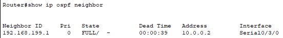
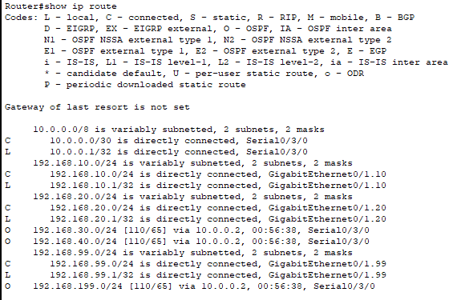
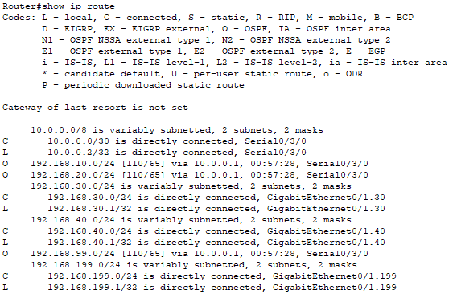
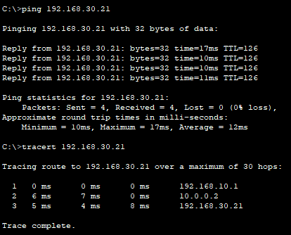

# Multi-Site Enterprise Network Lab
## Overview

This project simulates a multi-site enterprise network using Cisco Packet Tracer.

The environment consists of a Main Office and a Branch Office connected through a WAN link. Dynamic routing is implemented using OSPF, allowing automatic route exchange between sites.

The project demonstrates VLAN segmentation, Router-on-a-Stick, DHCP services, WAN connectivity, and dynamic routing.

## Network Topology

## Network Architecture

### Main Office

| VLAN | Department | Network |
|--------|--------|--------|
| 10 | Finance | 192.168.10.0/24 |
| 20 | HR | 192.168.20.0/24 |
| 99 | Management | 192.168.99.0/24 |

### Branch Office

| VLAN | Department | Network |
|--------|--------|--------|
| 30 | Sales | 192.168.30.0/24 |
| 40 | Support | 192.168.40.0/24 |
| 199 | Management | 192.168.199.0/24 |

### WAN

| Network | Purpose |
|----------|----------|
| 10.0.0.0/30 | Router-to-Router WAN Link |

## Technologies Implemented

- VLAN Segmentation
- IEEE 802.1Q Trunking
- Router-on-a-Stick
- DHCP
- OSPF Dynamic Routing
- WAN Serial Connection
- Inter-VLAN Routing
- Multi-Site Connectivity

## OSPF Configuration

OSPF Area 0 was configured between both routers to dynamically exchange routes between the Main Office and Branch Office.

This allows automatic route learning and end-to-end connectivity between all VLANs across both sites.

## Validation Tests

### OSPF Neighbor Relationship

Verified successful OSPF adjacency between routers.

Router 1 OSPF neighbor:

Router 2 OSPF neighbor:

### Dynamic Route Learning

Verified OSPF-learned routes on both routers.

OSPF successfully exchanged routing information between the Main Office and Branch Office routers.

The routing tables show remote networks learned dynamically through OSPF, eliminating the need for static routes.

Remote VLAN networks from each site were automatically discovered and installed in the routing table, validating proper OSPF operation across the WAN link.

### End-to-End Connectivity

Successful ping tests between devices located in different sites and VLANs.

Successful communication was verified between the Main Office Finance VLAN and the Branch Office Sales VLAN.

Traceroute confirmed that traffic crossed the WAN link and reached the remote destination through OSPF-learned routes.

## Key Learnings

- Designing multi-site enterprise networks
- Implementing Router-on-a-Stick
- Configuring OSPF dynamic routing
- Understanding WAN connectivity concepts
- Troubleshooting Layer 2 and Layer 3 connectivity issues
- Managing VLAN segmentation across multiple sites
