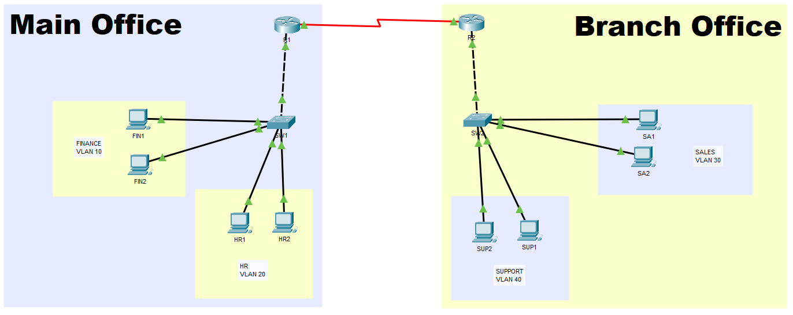

# multi-site-enterprise-network
## Overview

This project simulates a multi-site enterprise network using Cisco Packet Tracer.

The environment consists of a Main Office and a Branch Office connected through a WAN link. Dynamic routing is implemented using OSPF, allowing automatic route exchange between sites.

The project demonstrates VLAN segmentation, Router-on-a-Stick, DHCP services, WAN connectivity, and dynamic routing.

## Network Topology

## Network Architecture

### Main Office

| VLAN | Department | Network |
|--------|--------|--------|
| 10 | Finance | 192.168.10.0/24 |
| 20 | HR | 192.168.20.0/24 |
| 99 | Management | 192.168.99.0/24 |

### Branch Office

| VLAN | Department | Network |
|--------|--------|--------|
| 30 | Sales | 192.168.30.0/24 |
| 40 | Support | 192.168.40.0/24 |
| 199 | Management | 192.168.199.0/24 |

### WAN

| Network | Purpose |
|----------|----------|
| 10.0.0.0/30 | Router-to-Router WAN Link |

## Technologies Implemented

- VLAN Segmentation
- IEEE 802.1Q Trunking
- Router-on-a-Stick
- DHCP
- OSPF Dynamic Routing
- WAN Serial Connection
- Inter-VLAN Routing
- Multi-Site Connectivity

## OSPF Configuration

OSPF Area 0 was configured between both routers to dynamically exchange routes between the Main Office and Branch Office.

This allows automatic route learning and end-to-end connectivity between all VLANs across both sites.

## Validation Tests

### OSPF Neighbor Relationship

Verified successful OSPF adjacency between routers.

### Dynamic Route Learning

Verified OSPF-learned routes on both routers.

### End-to-End Connectivity

Successful ping tests between devices located in different sites and VLANs.

## Key Learnings

- Designing multi-site enterprise networks
- Implementing Router-on-a-Stick
- Configuring OSPF dynamic routing
- Understanding WAN connectivity concepts
- Troubleshooting Layer 2 and Layer 3 connectivity issues
- Managing VLAN segmentation across multiple sites
